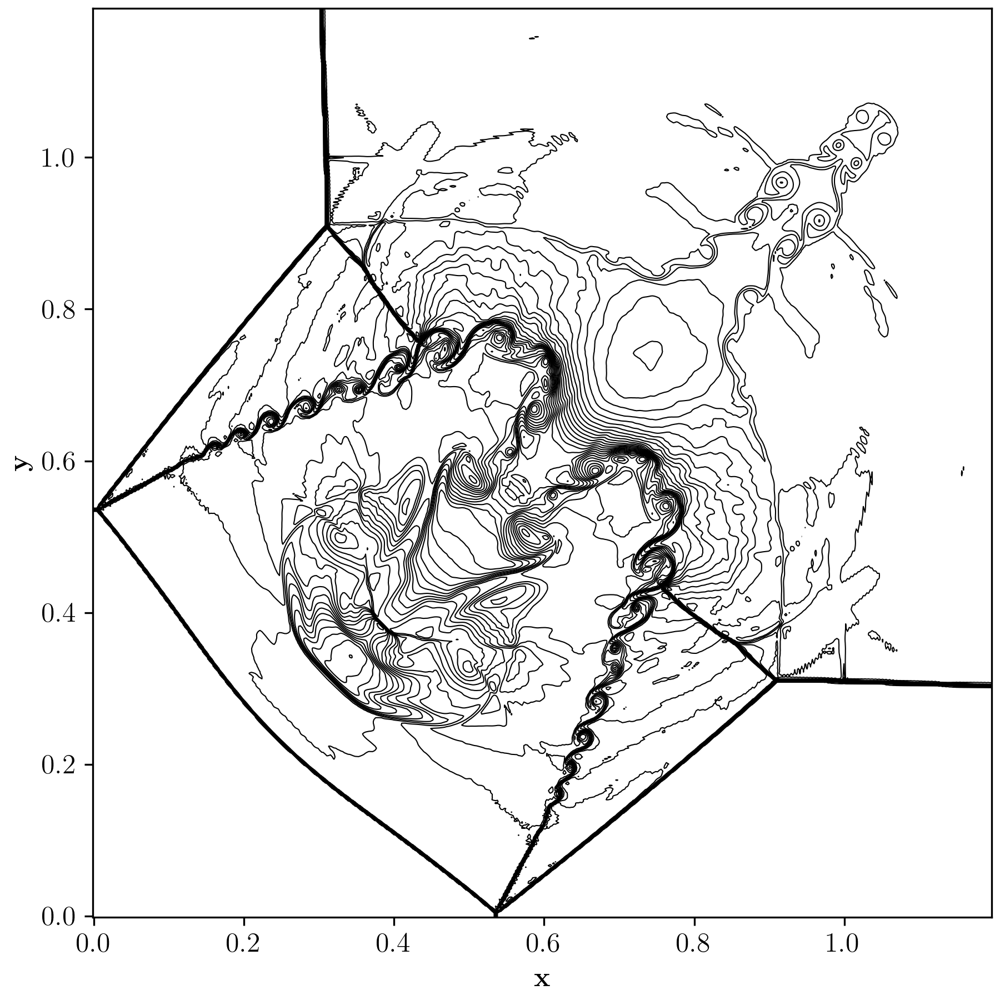
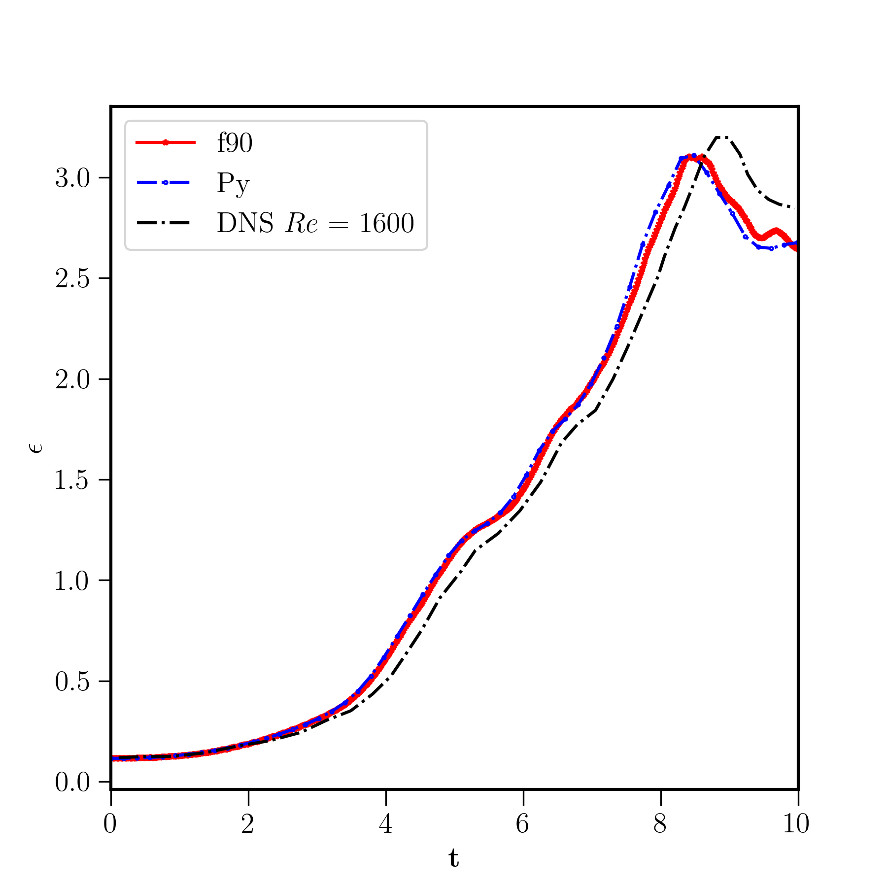

# WA-Warp: Wave-Appropriate 3D Compressible Euler Solver on GPU

A high-performance 3D compressible Euler solver implemented in [NVIDIA Warp](https://github.com/NVIDIA/warp), based on the wave-appropriate reconstruction framework of Chamarthi et al. (2023–2026). Initially, it was a fun project, but I realized it has significant potential and will develop it into a fully functional code.


*Q-criterion isosurface (Q=4.0) coloured by vorticity magnitude |ω| for the inviscid Taylor-Green Vortex at t=10, N=512³.*

---

## Key Features

- **Wave-appropriate reconstruction** — each characteristic wave family (acoustic, entropy, vortical) is treated with its physically appropriate scheme
- **SoA memory layout** `cons[var, ix, iy, iz]` for coalesced GPU memory access. Needed some modifications.
- **SSP-RK3** time integration
- **Ducros sensor** for shock detection and for the contact discontinuity rank-1 correction is used. 

## Numerical Scheme

| Region | Acoustic waves | Entropy wave | Vortical waves |
|--------|---------------|--------------|----------------|
| Smooth | Upwind (`eta=0.6`) | MP5 | Central-6 (`kai=0.5`) |
| Shock | WENO-Z/MP | WENO-Z/MP | WENO-Z/MP |  

Or corresponding conservative variables, depending on the direction, will have appropriate values of \eta and kai (kai, a random name I used during development).

In regions of shock waves, one can also perform wave-appropriate centralization. However, this is not included in the current Python code. There are many possible choices. :)

The wave-appropriate framework decomposes the flow into its five characteristic families and applies the minimum necessary dissipation to each:

- **Acoustic waves** — upwind-biased (η = 0.6) for stability near shocks and in **general**. See double shear layer case in paper 5, 3, 2 and 1, please.
- **Entropy wave** — MP5 in smooth regions, WENO-Z (or MP5 or MUSCL) near shocks; rank-1 correction from WA-CR
- **Vortical waves** — central (η = 0.5) to preserve turbulent structures

- For more details see please see the References, mainly 2 and 3.

## Installation

```bash
pip install warp-lang numpy matplotlib
```

## Usage

```bash
# Inviscid Taylor-Green Vortex, 64³
python 3D_TGV_WA.py

# 128³
python 3D_TGV_WA.py --n 128

# 512³ (A100 or better)
python 3D_TGV_WA.py --n 512

# CPU mode
python 3D_TGV_WA.py --n 64 --cpu
```

## Output

Each snapshot is saved as a compressed `.npz` file containing:

```
time, x, y, z, rho, p, u, v, w
```

Change to Tecplot or VTK files if necessary. 

## Visualization

  Can use Python scripts for plotting, but the code does periodically plot the output. Can disable it if not required. Pyvista or Paraview.


## Performance (A100 80GB)

| Grid | Memory | Time/step | Steps (t=10) | Wall time |
|------|--------|-----------|--------------|-----------|
| 64³  | ~0.5 GB | ~5 ms | ~1,500 | ~2 min |
| 512³ | ~49 GB | ~1.2 s | ~28,000 | ~9 hr |


Could run 200M for inviscid case and 150M for viscous case in 3D on one GPU with 80 GB VRAM.


## 2D Riemann Problem (Configuration 3)

The other two codes in the repository simulate the 2D Riemann problem by using WA-3 or WA-WENO-CR. Both of them work with NVIDIA Warp

![2D Riemann Problem — WA-3 scheme]
<p align="center">
  
</p>


*Density contours for the 2D Riemann problem  using the WA-3 approach, 512² grid, t=1.1. Wall time: 11s on A100 (WA-WENO-CR).*

Two solvers are included:
- `MUSCL_WA.py` — WA-3 approach
- `WENO_PNG_Cheap.py` — WA-WENO-CR approach (11s on A100 at 512², an hour and few minutes for 2048²)

I’ll add the multicomponent and multiphase codes later, and I might even add geometries like curvilinear or immersed boundary.

It was enjoyable. It was faster than nvFORTRAN for reasons I don’t understand. For instance, the Riemann problem took about 24 seconds with FORTRAN code. I like the CUDA code I get. :)

It matches really well for the viscous TGV, which is not included in this code. This is a case against the FORTRAN code.

<p align="center">
  
</p>

## References

1. Chamarthi, Hoffmann, Frankel — *A wave appropriate discontinuity sensor approach for compressible flows*, **Phys. Fluids** 35, 066107 (2023)
2. Hoffmann, Chamarthi, Frankel — *Centralized gradient-based reconstruction for wall modeled large eddy simulations of hypersonic boundary layer transition*, **J. Comput. Phys.** (2024)
3. Chamarthi — *Wave-appropriate multidimensional upwinding approach for compressible multiphase flows*, **J. Comput. Phys.** 538, 114157 (2025)
4. Chamarthi — *Physics appropriate interface capturing reconstruction approach for viscous compressible multicomponent flows*, **Comput. Fluids** 303, 106858 (2025)
5. Chamarthi — *Wave-appropriate reconstruction of compressible flows: physics-constrained acoustic dissipation and rank-1 entropy wave correction*, preprint (2026)

## Author

**Amareshwara Sainadh Chamarthi** sainath@caltech.edu
